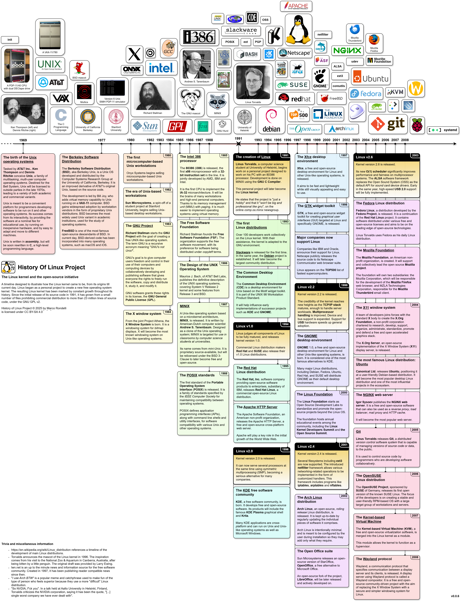

# History Of Linux Project

      
    
    
     
    <i>How the Linux kernel came to be,</i>  
    <i>from its origins till today</i>

---

Timeline (<i>click here to expand</i>)

 

---

## What is HOLP
__History Of Linux Project__ (HOLP) is an open-source initiative, aimed at illustrating the 
history of Linux and the open-source initiative, by using a timeline with colorful cards and images. Each card in the diagram 
represents a core event in history that contributed to the creation of Linux and to what Linux 
is, today. Images placed above the timeline illustrate important figures, 
logos belonging to companies or organizations that helped directly or passively with the 
creation of Linux.

Visit the [Wikipedia article](https://en.wikipedia.org/wiki/History_of_Linux) from which this project takes inspiration from.

Visit the [website](https://markgotlasagna.github.io/holp/) for an interactive version. (WIP)

## Goals
1. Illustrate how Linux came to be, from its birth till present day.
2. Preserve the history of the Linux kernel's development.
3. Be an academic resource for teaching Linux's history.
4. Raise awareness of the open-source initiative.

## Download
To download the latest version of the timeline, please visit the [releases page](https://github.com/MarkGotLasagna/holp/releases). 
For any version, click on the "Assets" drop-down menu and then click on the file you want to download. 
The timeline will always be provided in both `drawio` and `png` formats.
The `pdf` version is provided for major releases only.
- The `Timeline.drawio` file contains the actual diagram that you may modify to your likes and needs.
- The `Timeline.png` file contains the exported diagram in PNG format, usually at a 300ppi resolution.
- The `Timeline.pdf` file contains the diagram in PDF format, for printing. (WIP)

## How to contribute
HOLP is an open-source project. As such, it welcomes volunteers to:
- add, remove or modify cards about historical events;
- fact check written information, including both cards and dates;
- suggest artistic changes to the timeline; 
- enhance accessibility and readability;
- add translations.

If you'd like to contribute to this project, please read the [contribution guidelines](https://github.com/MarkGotLasagna/holp/wiki/Contribution-guidelines) document first. (WIP) 
All external contributions will be credited below.

---
- (LUGMan.org) [Associazione Culturale LUGMan](https://lugman.org/Pagina_principale)
- (Reddit) [r/linux](https://www.reddit.com/r/linux/) - History of Linux: a timeline [pt.1](https://www.reddit.com/r/linux/comments/1oeclk9/history_of_linux_a_timeline_pt_1/)/[pt.2](https://www.reddit.com/r/linux/comments/1sfvpsn/history_of_linux_a_timeline_pt_2/)
- (YouTube) [YouTux Channel](https://www.youtube.com/@YouTuxChannel) - [The history of LINUX in one picture](https://www.youtube.com/watch?v=_O7gn6sqJHA) 
